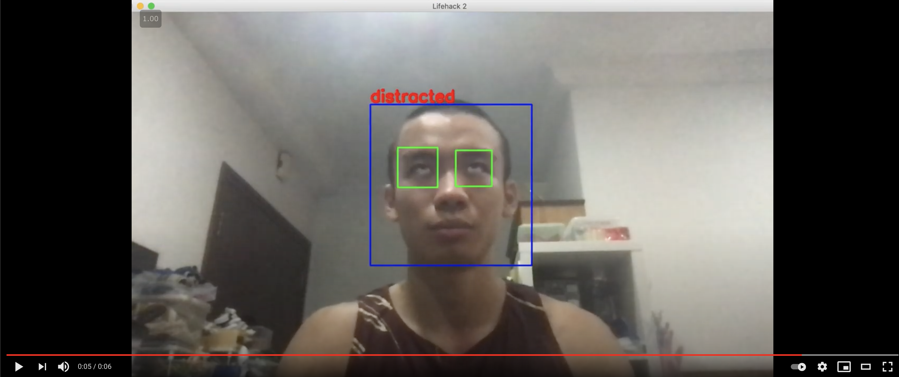

# Nirvana - Reimagining Flipped Classroom Engagement for teachers

### How we built Nirvana’s attention tracking software

We built the attention tracking software with computer vision. This was how we approached the problem : 

Step 1: We Used OpenCV [Haar Cascade Face Detector] to detect a person's face.

Step 2: After detecting the face, the person's eyes are then located using the OpenCV and a pretrained Convolutional Neural Network (CNN) is used to predict whether a person is distracted or not using a binary classifier. The CNN was trained on eye images created by us where we took open data sets of people who looked distracted and focused in online meetings as well as data from our faces.

### Video Demo

Below table contains all the important scripts in this repo.

| File  | Description  |
|---|---|
| [`get_data.py`](https://github.com/ExtremelySunnyYK/Lifehack-2021/blob/master/src/get_data.py)  | Creates training data for Distraction Classifier  |
| [`train.py`](https://github.com/johannesharmse/ExtremelySunnyYK/Lifehack-2021/master/src/cnn/train.py)  | Creates and trains Distraction Classifier using Keras  |
| [`distraction_detector.py`](https://github.com/ExtremelySunnyYK/Lifehack-2021/blob/master/src/distraction_detector.py)  | Detects distraction using OpenCV and Keras |

### Inspiration
Due to the pandemic, many school systems around the world have been upended, resulting in teachers having to adopt remote and hybrid learning fast. According to The Harvard Gazette, more than 90% of the world’s schools closed at the height of the pandemic, and about 213 millions students are still fully remote. With the uncertainty of the future scenarios of the pandemic, and with remote learning here to stay, teachers are relying more on alternative approaches such as the flipped classroom approach. While this learning format has been effective, teachers are still finding it incredibly challenging to ensure their students are engaged, especially with the lack of face-to-face lessons. 

A user interview with one of our group member’s parents - who are both primary school teachers, showed that one of most significant challenges for teachers is maintaining their student’s attention, engagement, and distractibility levels in the flipped. “Being unable to see our students face-to-face has made it more difficult to understand their attention and engagement during lessons. This makes the task of knowing if our students are paying attention very challenging, especially when I have to look out for over 30 students at a time,” shares XX. 

### What it does 
Nirvana allows teachers to understand the attention and engagement levels of their students during flipped classrooms. Our solution identifies when students are distracted during their own learning of class materials, and during online class time. Through detecting student’s eye movements and yawns using computer vision algorithms, and through identifying interactions with content through heatmap analytics, Nirvana allows teachers to understand students’ engagement levels throughout the entire flipped classroom cycle. 

#### Understand student engagement with teaching materials through heatmap analytics:

 During the self-directed learning portion, teachers will be able to see how the students interact with class materials, through understanding their clicks, taps, scrolling behaviors, or average drop-off rate, to understand what content their students are interested in. Nirvana gives teachers an aggregate of engagement across their teaching materials, allowing teachers to identify areas of weakness or opportunities in their teaching materials. This can allow them to better plan and design their teaching materials to increase student engagement. 

#### Identifying distracted students during online classes through computer vision algorithms: 

During online classes, teachers will receive pings that remind them to check in with their students when our computer vision algorithm detects that students are distracted. At the end of the class, teachers also receive a custom report that shows a summary of their class's attention and engagement during the class. Metrics such as distraction rate, average attention span, and engagement level will be provided along with key insights and visualization charts that can help teachers improve future classes

#### Improving lesson plan with end-to-end student engagement insights: 

Tracking the engagement levels from all touchpoints of the flipped classroom will enable teachers to have a good overview of their student’s engagement; from the teaching materials to the online classes. Having key metrics and visualisation of data through the Nirvana dashboard or custom report enables teachers to easily access how engaged students are in their teaching materials and online classes. This will allow the teachers to identify improvement areas in their current lessons, utilise data to plan for future lessons, and also track their student’s engagement progress over time. 

#### Protecting student’s data with Incognito activation: 

This allows teachers to collect anonymised user behaviour to get an overview of the student’s engagement, while protecting end-user privacy. With a private and protected version, it makes sures that Nirvana is compliant with the different privacy laws in different countries. 

### Impact of Nirvana: 
- Increased engagement levels
- Better student-teacher relationship: Having insights into student engagement levels from the teaching materials to online classes allows teachers to understand more about their student’s individual needs and requirements. This allows teachers to develop more personalised lessons, and also enables them to reach out to students who might require more help. 
- Reduced time and cost in lesson planning

